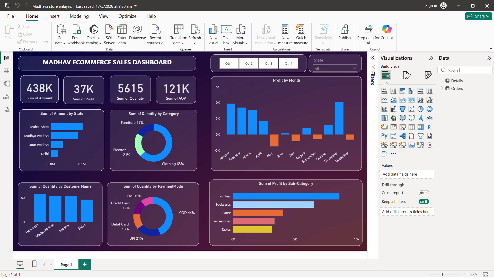

# Madhava Store E-Commerce Sales Analysis

## 📊 Project Overview

Madhava Store E-Commerce Sales Analysis is an interactive **Power BI dashboard** created to analyze sales, profit, quantity, customers, products, payment methods, and geographical performance.

The project demonstrates the complete data analysis workflow from **data cleaning and transformation to visualization and business insights**.

## 🎯 Objectives

* Analyze overall sales and profit performance
* Identify top-performing categories and sub-categories
* Analyze sales and profit trends
* Understand customer purchasing behavior
* Analyze payment methods
* Identify high-performing states
* Create interactive business KPIs

## 🛠️ Tools & Technologies

* **Power BI**
* **Power Query**
* **DAX**
* **Microsoft Excel**
* Data Visualization
* Data Analysis

## 🔄 Project Workflow

### 1. Data Cleaning & Transformation

Used **Power Query** to clean and transform the raw Excel data, check data types, handle inconsistencies, and prepare the data for analysis.

### 2. Data Modeling

Created relationships between the required tables to enable analysis across orders, customers, products, and other business dimensions.

### 3. DAX

Created measures to calculate important business KPIs such as:

* Total Amount
* Total Profit
* Total Quantity
* Average Order Value (AOV)

### 4. Dashboard Development

Created an interactive Power BI dashboard using:

* KPI Cards
* Bar Charts
* Donut Charts
* Line Charts
* Maps
* Slicers
* Interactive Filters

## 📈 Analysis Performed

The dashboard analyzes:

* Sales/Amount
* Profit
* Quantity
* Average Order Value
* Profit by Sub-Category
* Quantity by Category
* Payment Mode
* State-wise performance
* Customer performance
* Time-based sales and profit trends

## 💡 Business Insights

The dashboard helps identify:

* Top-performing product categories
* Most profitable sub-categories
* High-performing states
* Customer purchasing patterns
* Popular payment methods
* Sales and profit trends over time

These insights can help businesses monitor performance and make **data-driven decisions**.

## 👨‍💻 My Role

**Data Analyst / Power BI Developer**

I worked on data cleaning, data transformation, data modeling, DAX calculations, dashboard development, data visualization, and business insight generation.

## 📷 Dashboard Preview

## 📁 Project Files

* `Madhava_Store_Analysis.pbix` — Power BI dashboard
* `Madhava_Store_Dataset.xlsx` — Source dataset
* `Dashboard.png` — Dashboard preview

## 🚀 Skills Demonstrated

**Power BI | Power Query | DAX | Excel | Data Cleaning | Data Modeling | Data Visualization | Business Analysis | KPI Development**
